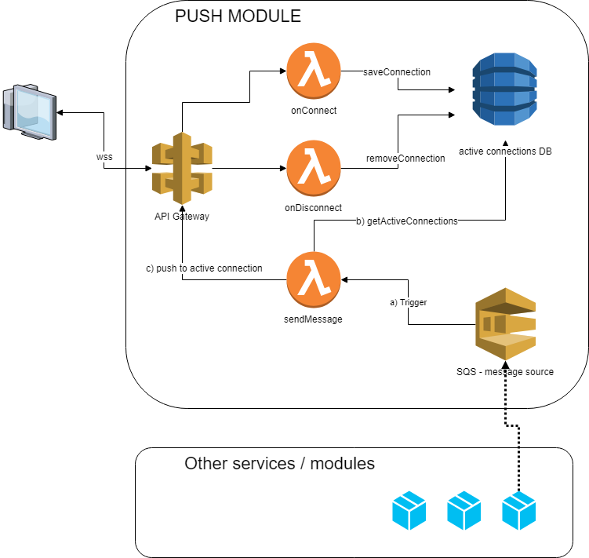

# push module - PoC

strongly inspired [simple-websockets-chat-app](https://serverlessrepo.aws.amazon.com/applications/arn:aws:serverlessrepo:us-east-1:729047367331:applications~simple-websockets-chat-app) by AWS SAM.

There are three functions contained within the directories and a SAM template that wires them up to a DynamoDB table and provides the minimal set of permissions needed to run the app:

```
.
├── README.md                   <-- This instructions file
├── onConnect                   <-- Source code onConnect - proxy from api gateway
├── onDisconnect                <-- Source code onDisconnect - proxy from api gateway
├── sendMessage                 <-- Source code sendMessage - not used - obsolete
├── sendToUser                  <-- Source code sendToUsser - sqs trigger for sending message to user
└── template.yaml               <-- SAM template for Lambda Functions, SQS and DDB
```



## SQS message

SQS message is expected to be string - serialized json with `userId` key and `message` key. Message is sent to user as is if there is a wss connection from user identified by userId. UserId is `sub` (user id) from cognito jwt token.

## WSS - test connection

```bash
wscat -c wss://<apigw-id>.execute-api.eu-west-1.amazonaws.com/DEV -H Authorization:<CognitoIdToken>
```

# Deploying

## AWS CLI commands

You need to have installed the [AWS SAM CLI](https://docs.aws.amazon.com/serverless-application-model/latest/developerguide/serverless-sam-cli-install.html) and use it to package, deploy (and describe your application). These are the commands you'll need to use:

```
sam package \
    --template-file template.yaml \
    --output-template-file packaged.yaml \
    --s3-bucket REPLACE_THIS_WITH_YOUR_S3_BUCKET_NAME

sam deploy \
    --template-file packaged.yaml \
    --stack-name hbr-push \
    --capabilities CAPABILITY_IAM

aws cloudformation describe-stacks \
    --stack-name hbr-push --query 'Stacks[].Outputs'
```
