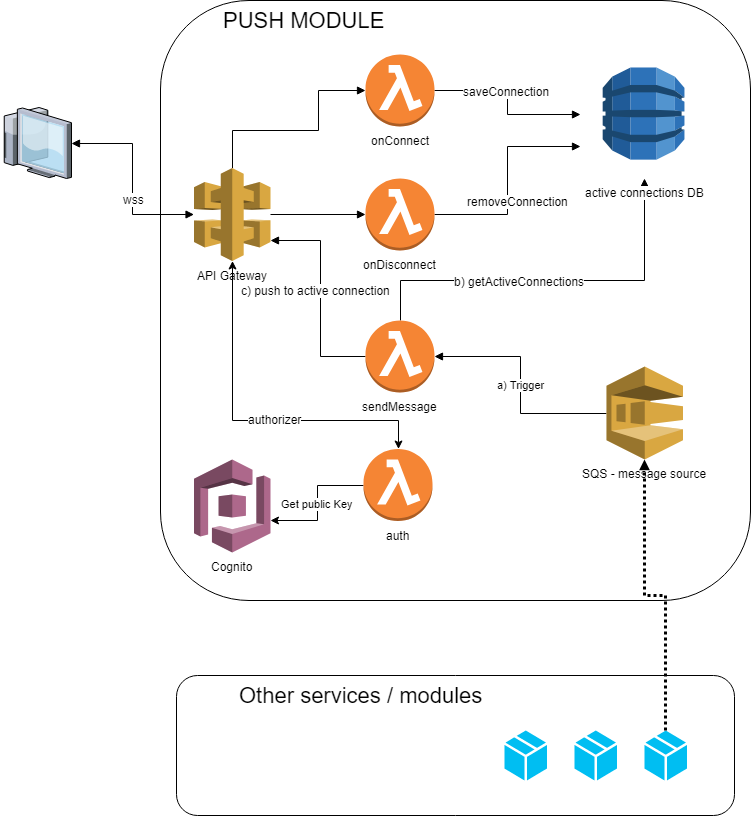

# push module - PoC

strongly inspired [simple-websockets-chat-app](https://serverlessrepo.aws.amazon.com/applications/arn:aws:serverlessrepo:us-east-1:729047367331:applications~simple-websockets-chat-app) by AWS SAM.


There are three functions contained within the directories and a SAM template that wires them up to a DynamoDB table and provides the minimal set of permissions needed to run the app:

```
.
├── README.md                   <-- This instructions file
├── onConnect                   <-- Source code onConnect - proxy from api gateway
├── onDisconnect                <-- Source code onDisconnect - proxy from api gateway
├── sendMessage                 <-- Source code sendMessage - sqs trigger and proxy from apigateway
└── template.yaml               <-- SAM template for Lambda Functions, SQS and DDB
```



# Deploying 

## AWS CLI commands

You need to have installed the [AWS SAM CLI](https://docs.aws.amazon.com/serverless-application-model/latest/developerguide/serverless-sam-cli-install.html) and use it to package, deploy (and describe your application).  These are the commands you'll need to use:

```
sam package \
    --template-file template.yaml \
    --output-template-file packaged.yaml \
    --s3-bucket REPLACE_THIS_WITH_YOUR_S3_BUCKET_NAME

sam deploy \
    --template-file packaged.yaml \
    --stack-name hbr-push \
    --capabilities CAPABILITY_IAM 

aws cloudformation describe-stacks \
    --stack-name hbr-push --query 'Stacks[].Outputs'
```

